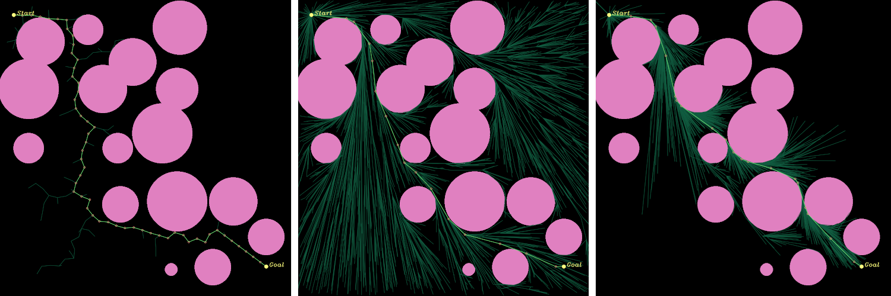

# sampling-based-planners
Pure C++ implementation of RRT, RRT*, and Informed-RRT* as a shared library which are incremental sampling-based path planning methods, and it supports any dimensions

#### TODO
- Implement Informed-RRT* (Sorry, it has not been implemented yet)
- Implement `examples/path-planner-3D`
    - abopt python API (Python.h) and use matplotlib in order to plot 3D graph

## Features
- Provided as a shared library usable in **C++14** or higher
- You can execute at **any dimensions** without recompiling the shared library
- **Pure C++ implementation**
    - Implemented without dependent libraries such as Boost, Eigen, OpenCV, and so on

## Requirements
The following software packages are required for building the shared library
- A C++ compiler with **C++14** or higher support
- CMake **3.0** or higher

If you would like to compile the example programs, add the following:
- OpenCV **3.0** or higher

## Build
The shared library (**libplanner.so**) can be build with following commands

``` sh
$ git clone git@github.com:kyk0910/sampling-based-planners.git
$ cd sampling-based-planners/lib
$ mkdir build && cd build
$ cmake ..
$ make
```

The example program can be run with following commands after build the shared library

``` sh
$ cd <top of this repository>
$ git submodule update --init
$ cd examples/<example program directory>
$ mkdir build && cd build
$ cmake ..
$ make
```

## Usage
### 1. Include header file
``` c++
#include <planner.h>
```

### 2. Difine target euclidean space
``` c++
// difinition of two-dimensional space
const int DIM = 2;
planner::EuclideanSpace space(DIM);

// definition of bounds of each dimension
std::vector<planner::Bound> bounds{planner::Bound(0, 100.0),
                                   planner::Bound(0, 100.0)};
                                   
// set bounds to space
space.setBound(bounds);
```

### 3. Define constraints
#### i. Point cloud type
``` c++
// definition of obstacle (point cloud type)
std::vector<planner::PointCloudConstraint::Hypersphere> obstacles;
obstacles.emplace_back(planner::State(5.0,  20.0), 10.0); // x : 5.0,  y : 20.0, radius : 10.0
obstacles.emplace_back(planner::State(50.0, 80.0), 30.0); // x : 50.0, y : 80.0, radius : 30.0

// definition of constraint
planner::PointCloudConstraint constraint(space, obstacles);
```

#### ii. Image type (use OpenCV for simplicity)
``` c++
// read image
auto world = cv::imread("./example.png", CV_8UC1);

// definition of constraint array
std::vector<planner::ConstraintType> constraint_map(world.cols * world.rows,
                                                    planner::ConstraintType::ENTAERABLE);
for(int yi = 0; yi < world.rows; yi++) {
    for(int xi = 0; xi < world.cols; xi++) {
        if(world.data[xi + yi * world.cols] != 255) {
            constraint_map[xi + yi * world.cols] = planner::ConstraintType::NOENTRY;
        }
    }
}

std::vector<uint32_t> each_dim_size{(uint32_t)world.cols, (uint32_t)world.rows};

// definition of constraint
planner::SemanticSegmentConstraint constraint(space, constraint_map, each_dim_size);
```

### 4. Solve path planning
``` c++
// definition of planner (you can set some parameters)
planner::RRTStar planner(DIM,
                         max_sampling_num,
                         goal_sampling_rate,
                         expand_dist,
                         R);

// set constraint
planner.setProblemDefinition(constraint);

// solve
bool status = planner.solve;
if(status) {
    auto result = planner.getResultRef();
    for(const auto& r : result) {
        std::cout << r << std::endl;
    }
}
else {
    std::cout << "Could not find path" << std::endl;
}
```

## Example programs

### Example1. path-planning-2D
Execute path planning on two-dimensional space

#### Pattern1. Constraint using set of circle
<div style="text-align: center;">
    
</div>

#### Pattern2. Constraint using image
<div style="text-align: center;">
    
</div>

## References
[Steven M. LaValle, "Rapidly-exploring random trees: A new tool for path planning," Technical Report. Computer Science Department, Iowa State University (TR 98–11).](http://msl.cs.uiuc.edu/~lavalle/papers/Lav98c.pdf)

[S. Karaman and E. Frazzoli, "Incremental Sampling-based Algorithms for Optimal Motion Planning," arXiv:1005.0416, May. 2010.](https://arxiv.org/pdf/1005.0416.pdf)

## License
MIT
